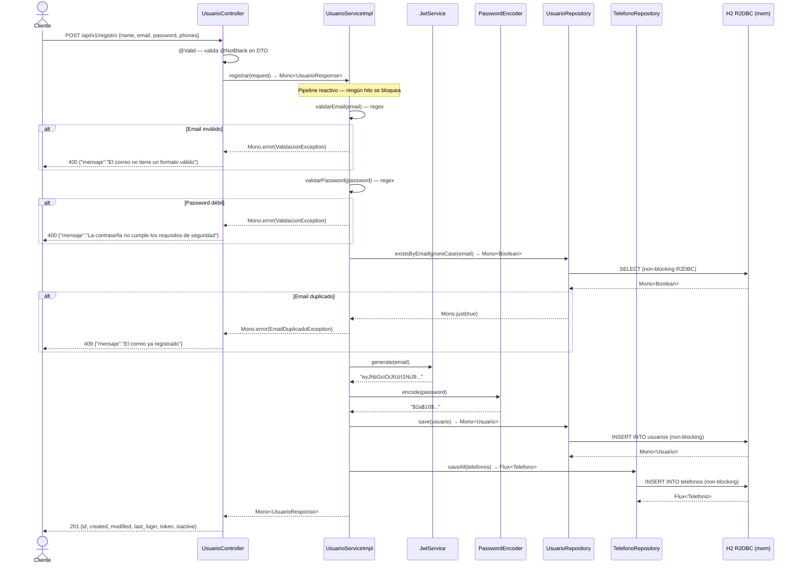

# ms-usuario-reactivo — API Reactiva de Registro de Usuarios

Microservicio **reactivo** construido con Spring Boot 3 + Spring WebFlux + R2DBC + H2.
Implementa el mismo contrato de API que la versión sincrónica, con modelo completamente no bloqueante usando Project Reactor.

---

## Stack tecnológico

| Capa | Tecnología |
|---|---|
| Framework | Spring Boot 3.2.3 |
| Paradigma | Reactivo (no bloqueante) |
| Web | Spring WebFlux |
| Persistencia | Spring Data R2DBC |
| Base de datos | H2 en memoria (R2DBC) |
| Seguridad | Spring Security Reactive + JWT (jjwt 0.12.3) |
| Hash password | BCrypt |
| Documentación | SpringDoc OpenAPI WebFlux |
| Tests | JUnit 5 + Mockito + StepVerifier + WebTestClient |
| Java | 17 |

---

## Requisitos

- Java 17+
- Maven 3.8+

---

## Cómo levantar

```bash
# Clonar el repositorio
git clone https://github.com/acairampoma/ms-usuario-reactivo.git
cd ms-usuario-reactivo

# Compilar y ejecutar
mvn spring-boot:run
```

La aplicación levanta en **http://localhost:8096**

---

## Cómo ejecutar los tests

```bash
mvn test
```

---

## Endpoints

### `POST /api/v1/registro`

Registra un nuevo usuario.

**Request:**
```json
{
  "name": "Juan Rodriguez",
  "email": "juan@rodriguez.org",
  "password": "Hunter2@",
  "phones": [
    {
      "number": "1234567",
      "citycode": "1",
      "contrycode": "57"
    }
  ]
}
```

**Response 201 Created:**
```json
{
  "id": "550e8400-e29b-41d4-a716-446655440000",
  "created": "2026-03-18T10:00:00",
  "modified": "2026-03-18T10:00:00",
  "last_login": "2026-03-18T10:00:00",
  "token": "eyJhbGciOiJIUzI1NiJ9...",
  "isactive": true
}
```

**Errores:**

| HTTP | Causa |
|---|---|
| 400 | Email con formato inválido |
| 400 | Contraseña no cumple requisitos de seguridad |
| 400 | Campo `name` ausente (Bean Validation) |
| 409 | El correo ya está registrado |

---

## Validaciones

- **Email:** debe cumplir formato estándar (configurable vía `app.validation.email-regex`)
- **Password:** mínimo 8 caracteres, al menos una mayúscula, una minúscula, un número y un carácter especial (`@$!%*?&`) (configurable vía `app.validation.password-regex`)

---

## Curls de prueba

```bash
# Registro exitoso
curl -s -X POST http://localhost:8096/api/v1/registro \
  -H "Content-Type: application/json" \
  -d '{"name":"Juan Rodriguez","email":"juan@rodriguez.org","password":"Hunter2@","phones":[{"number":"1234567","citycode":"1","contrycode":"57"}]}'

# Email duplicado → 409
curl -s -X POST http://localhost:8096/api/v1/registro \
  -H "Content-Type: application/json" \
  -d '{"name":"Juan Rodriguez","email":"juan@rodriguez.org","password":"Hunter2@","phones":[]}'

# Email inválido → 400
curl -s -X POST http://localhost:8096/api/v1/registro \
  -H "Content-Type: application/json" \
  -d '{"name":"Test","email":"no-es-email","password":"Hunter2@","phones":[]}'

# Contraseña débil → 400
curl -s -X POST http://localhost:8096/api/v1/registro \
  -H "Content-Type: application/json" \
  -d '{"name":"Test","email":"test@test.com","password":"debil","phones":[]}'
```

---

## Swagger UI

Disponible en: **http://localhost:8096/swagger-ui.html**

Documentación OpenAPI en: **http://localhost:8096/v3/api-docs**

---

## Diferencias frente a la versión sincrónica

| Aspecto | ms-usuario (sync) | ms-usuario-reactivo |
|---|---|---|
| Modelo | Bloqueante (hilo por request) | No bloqueante (event loop) |
| Web | Spring MVC | Spring WebFlux |
| Persistencia | JPA / Hibernate | R2DBC |
| Retorno del servicio | `UsuarioResponse` | `Mono<UsuarioResponse>` |
| Tests de servicio | Mockito + AssertJ | Mockito + StepVerifier |
| Tests de controller | MockMvc | WebTestClient |
| Teléfonos | `@ElementCollection` | Tabla separada + `TelefonoRepository` |

---

## Diagrama de secuencia



---

## Patrones de diseño aplicados

| Patrón | Categoría | Dónde |
|---|---|---|
| Builder | Creacional | `Usuario.builder()` — construcción de entidad |
| Factory Method | Creacional | `UsuarioResponse.from(saved)` — construcción del DTO |
| Adapter | Estructural | `mapPhones()` — TelefonoRequest → Telefono |
| Facade | Estructural | `UsuarioController` — simplifica el acceso al servicio reactivo |
| Strategy | Comportamiento | `ValidationProperties` — regex intercambiable por entorno |
| Chain of Responsibility | Comportamiento | `GlobalExceptionHandler` — cadena de handlers de excepción |

## Principios SOLID aplicados

| Principio | Dónde |
|---|---|
| **S** — Single Responsibility | Cada clase tiene una única razón de cambio |
| **O** — Open/Closed | Nuevas validaciones se agregan sin modificar `UsuarioServiceImpl` |
| **L** — Liskov Substitution | `UsuarioServiceImpl` sustituye a `UsuarioService` sin romper contratos |
| **I** — Interface Segregation | `UsuarioService` expone solo `registrar()` |
| **D** — Dependency Inversion | El servicio depende de abstracciones (`UsuarioRepository`, `PasswordEncoder`) |
